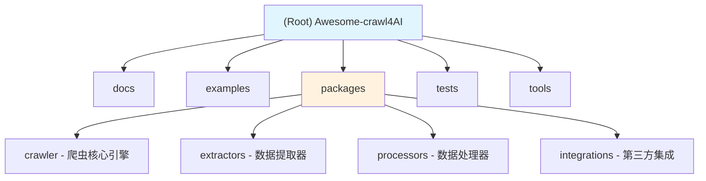

# Awesome-crawl4AI - AI 上下文文档

## 更改日志 (Change Log)

### 2025-12-25
- 初始化项目 AI 上下文文档
- 创建基础项目结构
- 建立模块索引和开发指南

---

## 项目愿景 (Project Vision)

Awesome-crawl4AI 是一个专注于为 AI 应用提供高质量网页数据采集解决方案的项目。该项目旨在构建现代化、智能化的网页爬取框架，特别优化了对 AI/LLM 应用的数据支持。

**核心目标：**
- 提供易于使用且高性能的网页爬取工具
- 支持 AI 友好的数据格式输出（如 Markdown、JSON、结构化数据）
- 集成现代网页技术处理能力（JavaScript 渲染、反爬虫对抗）
- 构建可扩展的插件生态系统

## 架构概览 (Architecture Overview)

```
awesome-crawl4ai/
├── docs/                 # 项目文档
├── examples/             # 示例代码和用例
├── packages/             # 核心包和模块
│   ├── crawler/          # 爬虫核心引擎
│   ├── extractors/       # 数据提取器
│   ├── processors/       # 数据处理器
│   └── integrations/     # 第三方集成
├── services/             # 微服务组件（可选）
├── tests/                # 测试套件
└── tools/                # 开发工具和脚本
```

**技术栈倾向：**
- **主要语言：** Python（数据处理和 AI 集成优势）
- **辅助技术：** TypeScript/Node.js（前端相关爬取）
- **数据存储：** SQLite/PostgreSQL（结构化数据）
- **队列系统：** Redis/Celery（任务调度）
- **AI 集成：** OpenAI API, LangChain, LlamaIndex

## 模块结构图



## 模块索引 (Module Index)

| 模块路径 | 职责描述 | 状态 | 语言 |
|---------|---------|------|------|
| `docs/` | 项目文档和 API 文档 | 计划中 | Markdown |
| `examples/` | 示例代码和用例演示 | 计划中 | Python/TS |
| `packages/crawler/` | 核心爬虫引擎和调度器 | 计划中 | Python |
| `packages/extractors/` | 数据提取和解析组件 | 计划中 | Python |
| `packages/processors/` | 数据清洗和转换处理 | 计划中 | Python |
| `packages/integrations/` | 第三方服务集成 | 计划中 | Python/TS |
| `tests/` | 测试套件和基准测试 | 计划中 | Python |
| `tools/` | 开发、部署和维护工具 | 计划中 | Python/Shell |

## 运行和开发 (Running and Development)

### 环境准备

**Python 环境（推荐）：**
```bash
# 创建虚拟环境
python -m venv venv
source venv/bin/activate  # Linux/Mac
# 或
venv\Scripts\activate     # Windows

# 安装依赖（待创建 requirements.txt）
pip install -r requirements.txt
```

**Node.js 环境（如需要）：**
```bash
# 安装依赖
npm install
# 或
yarn install
```

### 开发工作流

1. **克隆项目**
   ```bash
   git clone <repository-url>
   cd Awesome-crawl4AI
   ```

2. **配置环境**
   - 复制 `.env.example` 到 `.env`
   - 配置必要的 API 密钥和数据库连接

3. **运行测试**
   ```bash
   pytest tests/
   # 或
   python -m pytest
   ```

4. **代码质量检查**
   ```bash
   # Python 代码检查
   black . --check
   flake8 .
   mypy .

   # 类型检查
   pyright
   ```

## 测试策略 (Testing Strategy)

### 测试层级

1. **单元测试**
   - 每个模块的核心功能
   - 使用 pytest 框架
   - 目标覆盖率：>80%

2. **集成测试**
   - 模块间交互测试
   - 端到端爬取流程测试

3. **性能测试**
   - 爬取速度和资源使用
   - 并发处理能力

4. **反爬虫对抗测试**
   - 各种反爬虫机制的应对策略验证

### 测试组织

```
tests/
├── unit/              # 单元测试
│   ├── test_crawler.py
│   ├── test_extractors.py
│   └── test_processors.py
├── integration/       # 集成测试
│   ├── test_workflows.py
│   └── test_apis.py
├── performance/       # 性能测试
│   └── benchmarks.py
└── fixtures/          # 测试数据和模拟响应
    ├── html_pages/
    └── mock_responses.json
```

## 编码规范 (Coding Standards)

### Python 代码规范

- **风格指南：** 遵循 PEP 8
- **格式化工具：** Black
- **导入顺序：** 标准库 → 第三方库 → 本地模块
- **命名规范：**
  - 类名：`CapWords`
  - 函数/变量：`snake_case`
  - 常量：`UPPER_SNAKE_CASE`
  - 私有成员：`_leading_underscore`

### 文档规范

- **Docstring 格式：** Google Style 或 NumPy Style
- **类型注解：** 使用 Python Type Hints
- **示例代码：** 提供可运行的使用示例

### 代码审查清单

- [ ] 代码符合 PEP 8 规范
- [ ] 所有函数都有 docstring
- [ ] 关键函数有类型注解
- [ ] 有相应的单元测试
- [ ] 测试覆盖率达标
- [ ] 无安全漏洞（如 SQL 注入、XSS）
- [ ] 错误处理完善

## AI 使用指南 (AI Usage Guidelines)

### Claude Code 辅助开发

**推荐工作流：**

1. **理解现有代码**
   ```
   "请分析 packages/crawler/main.py 的核心逻辑和依赖关系"
   ```

2. **生成新功能**
   ```
   "请创建一个新的数据提取器，支持从网页中提取 LLM 友好的 Markdown 格式"
   ```

3. **代码审查**
   ```
   "请审查以下代码并提供改进建议：[代码片段]"
   ```

4. **调试辅助**
   ```
   "我遇到了这个错误，请帮我分析可能的原因：[错误信息]"
   ```

5. **测试生成**
   ```
   "请为 packages/extractors/html_extractor.py 生成完整的单元测试"
   ```

**最佳实践：**

- 提供清晰的任务描述和上下文
- 分阶段执行复杂任务
- 让 AI 解释代码逻辑而非仅生成代码
- 始终审查 AI 生成的代码
- 使用版本控制跟踪更改

### AI 辅助文档生成

- 自动生成 API 文档
- 创建使用示例
- 生成架构图和流程图
- 维护 FAQ 部分

## 项目路线图 (Roadmap)

### Phase 1: 基础框架（当前）
- [x] 项目结构初始化
- [ ] 核心爬虫引擎实现
- [ ] 基础数据提取器
- [ ] 单元测试框架

### Phase 2: 功能扩展
- [ ] JavaScript 渲染支持
- [ ] 反爬虫对抗机制
- [ ] 数据清洗和转换
- [ ] AI 集成接口

### Phase 3: 生态建设
- [ ] 插件系统
- [ ] API 服务
- [ ] 管理界面
- [ ] 性能优化

### Phase 4: 企业特性
- [ ] 分布式爬取
- [ ] 监控和告警
- [ ] 数据分析面板
- [ ] 企业级部署方案

## 常见问题 (FAQ)

### Q1: 这个项目与 Scrapy 有什么区别？
**A:** Awesome-crawl4AI 专注于 AI 应用的数据需求，提供了更智能的数据提取和格式转换功能，并且对 LLM 友好的输出格式进行了优化。

### Q2: 支持哪些类型的网站？
**A:** 支持静态网站、动态 JavaScript 渲染网站、SPA 应用，以及常见的 CMS 系统。

### Q3: 如何处理反爬虫？
**A:** 项目集成了多种反爬虫对抗策略，包括 User-Agent 轮换、代理池、请求限流、Cookie 管理等。

### Q4: 输出格式有哪些？
**A:** 支持 Markdown、JSON、CSV、纯文本，以及自定义的 AI 友好格式。

### Q5: 如何贡献代码？
**A:** 欢迎通过 Pull Request 贡献。请确保代码符合项目的编码规范，并通过所有测试。

## 相关资源 (Related Resources)

- **文档：** [即将创建]
- **示例：** [即将创建]
- **API 参考：** [即将创建]
- **问题反馈：** [即将创建]
- **贡献指南：** [即将创建]

---

**文档版本：** 1.0.0
**最后更新：** 2025-12-25
**维护者：** Awesome-crawl4AI Team
